# Hexterika Cyber Lab

## Penetration Testing Report

***Client Name:*** Severnaya Auxillary Control Station TryHackMe
***Date:*** 23 March 2025
***Version:*** 1.0

## Tables of Content

1. Confidentiality Statement
2. Disclaimer
3. Contact Information
4. Finding Severity Ratings
5. Executive Summary
6. Test Scope
7. Methodologies
8. Additional Information

## Confidentiality Statement

This document is the exclusive property of Severnaya Auxillary Control Station and Hexterika Cyber Lab. This document contains proprietary and confidential information. Duplication, redistribution, or use, in whole or in part, in any form, requires consent of both Severnaya Auxillary Control Station and Hexterika Cyber Lab.

Severnaya Auxiliary Control Station may share this document with auditors under non-disclosure agreements to demonstrate penetration test requirement compliance.

## Disclaimer

A penetration test is considered a snapshot in time. The findings and recommendations reflect the information gathered during the assessment and not any changes or modifications made outside of that period.

Time-limited engagements do not allow for a full evaluation of all security controls. Hexterika Cyber Lab prioritized the assessment to identify the weakest security controls an attacker would exploit. Hexterika Cyber Lab recommends conducting similar assessments on an annual basis by internal or third-party assessors to ensure the continued success of the controls.

---

## Contact Information

**Company:** Severnaya Auxillary Control Station

| **Name** | **Title** | **Contact Information** |
| :------: | :-------: | :---------------------: |
| Natalia  | Global Information Security Manager | Email: [ns@na.goldeneye](ns@na.goldeneye)|

**Company:** Hexterika Cyber Lab

| **Name** | **Title** | **Contact Information** |
| :------: | :-------: | :---------------------: |
| Sangsongthong C. | Penetration Tester | Email: [sangsongthong.c@hexterika-cyber-lab.work.gd](sangsongthong.c@hexterika-cyber-lab.work.gd) |

---

## Finding Severity Ratings

The following table defines levels of severity and corresponding CVSS score range that are used throughout the document to assess vulnerability and risk impact.

| Severity | CVSS V3 Score Range | Definition |
| :------: | :-----------------: | :--------: |
| Critical | 9.0 - 10.0 | Exploitation is straightforward and usually results in system-level compromise. It is advised to form a plan of action and patch immediately. |
| High     | 7.0 - 8.9  | Exploitation is more difficult but could cause elevated privileges and potentially a loss of data or downtime. It is advised to form a plan of action and patch as soon as possible. |
| Moderate | 4.0 - 6.9  | Vulnerabilities exist but are not exploitable or require extra steps such as social engineering. It is advised to form a plan of action and patch after high-priority issues have been resolved. |
| Low      | 0.1 - 3.9  | Vulnerabilities are non-exploitable but would reduce an organization’s attack surface. It is advised to form a plan of action and patch during the next maintenance window. |
| Informational | N/A   | No vulnerability exists. Additional information is provided regarding items noticed during testing, strong controls, and additional documentation. |

**Risk Factors** Risk is measured by two factors: Likelihood and Impact:

+ **Likelihood**

Likelihood measures the potential of a vulnerability being exploited. Ratings are given based on the difficulty of the attack, the available tools, attacker skill level, and client environment.

+ **Impact**

Impact measures the potential vulnerability’s effect on operations, including confidentiality, integrity, and availability of client systems and/or data, reputational harm, and financial loss.

---

## Executive Summary

Summary of Findings: Brief overview of critical findings.

Risk Level: High/Medium/Low (based on your findings).

Key Recommendations: Highlight main actions for the client.

---

## Test Scope

**Target Systems:**

+ 10.x.x.x (TryHackMe's Machine IPs changed every time that I access it but the inside are the same.)

**Scope Exclusions:**

Per client request, Hexterika Cyber Lab did not perform any of the following attacks during testing:

+ Denial of Service (DoS)

+ Phishing/Social Engineering

All other attacks not specified above were permitted by Severnaya Auxillary Control Station.

**Client Allowances:**

+ Internal access to network via VPN

**Testing Period:** 1 March 2025 - 4 March 2025

---

## Methodology

### Information Gathering

**Finding 1:** Information Exposure

**Description:**

The hidden login page that is supposed to be hidden was hidden in a very obsecured way. Even though using non-default ports for POP3 service, they can easily be found by using Nmap.

**Risk:** How this vulnerability could affect the system.

+ **Likelyhood:** High. Anyone who knows how to use Nmap and view source code can find it if they are snoopy.
  
+ **Impact:** Low.

**Tool Used:** Nmap

**Evidence:**

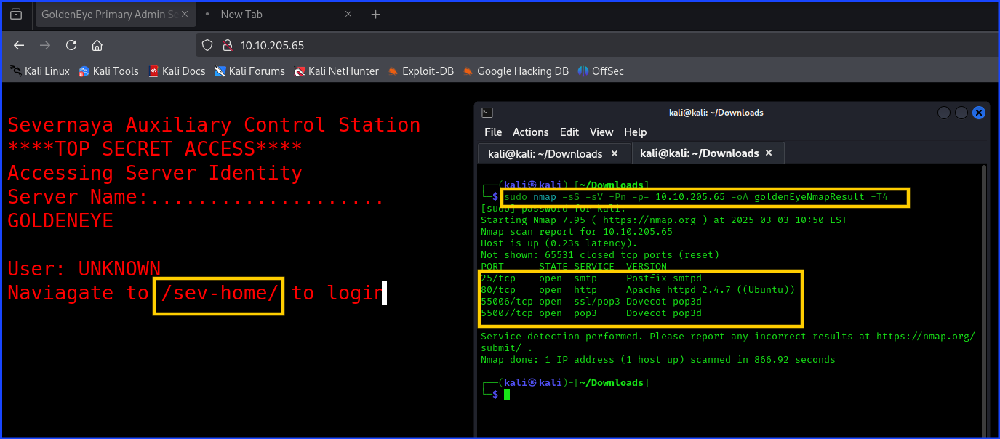

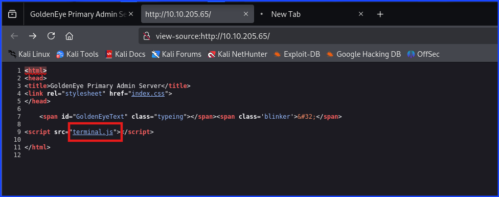

**Remediation:**

Depend on the comfort level of the company that the login page is being expose to the outsider. It is not easy to find for average people, but if they know how to view the page source code and be snoopy, they will find it.

Even though the service ports are non-default, they can easily be found using Nmap.

---

**Finding 2:** Weak Password

**Description:**

The password is easily to crack. I used Burp Suite's smart decoder to decode Boris's password.

**Risk:** How this vulnerability could affect the system.

+ **Likelyhood:**
  
+ **Impact:**

**Tool Used:** Burp, Firefox, hashcat

**Evidence:**

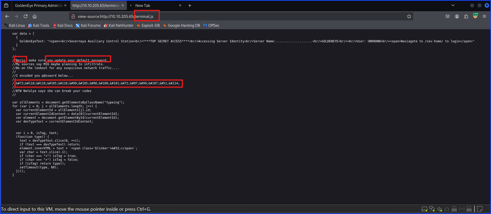

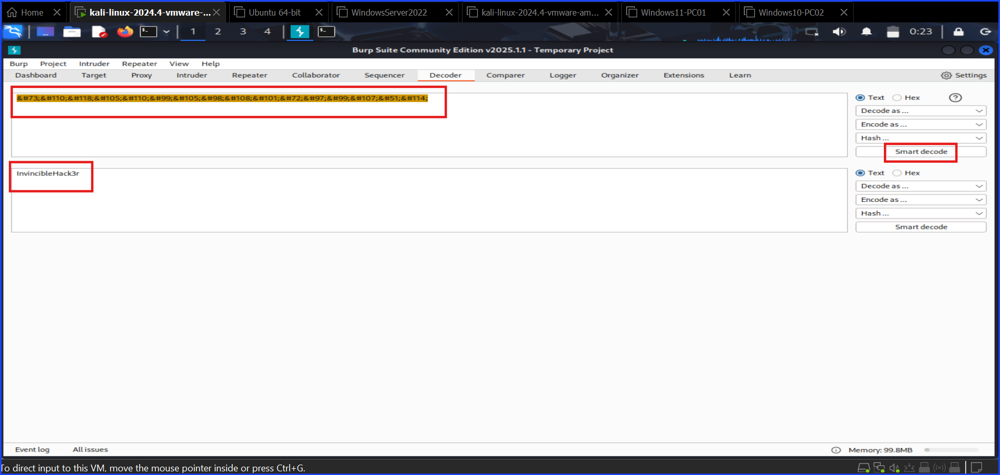

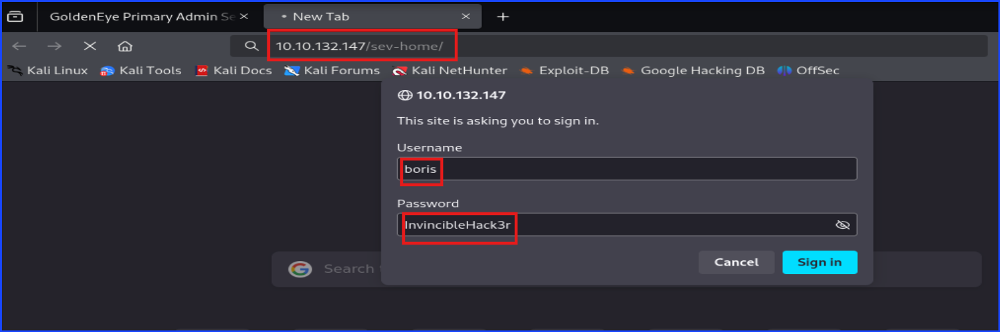

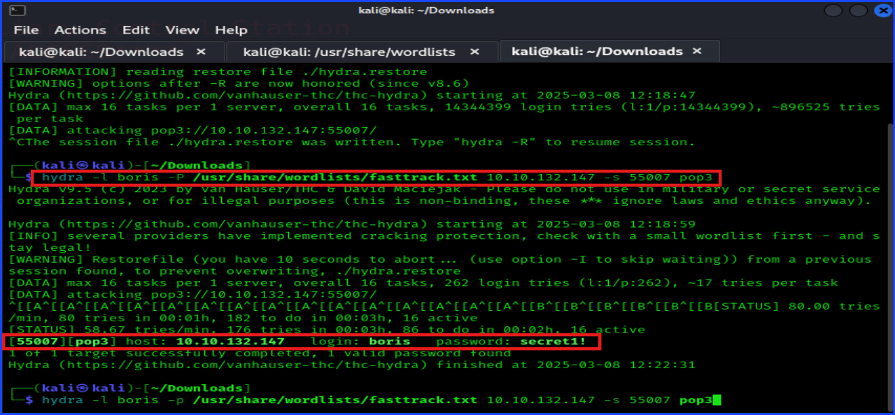

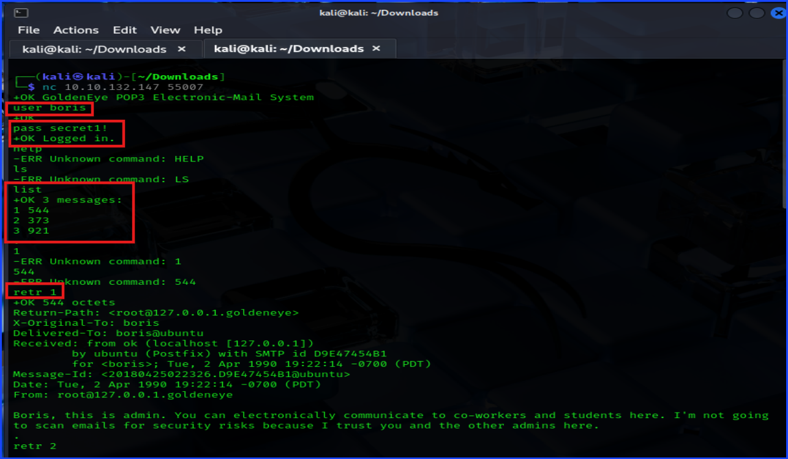

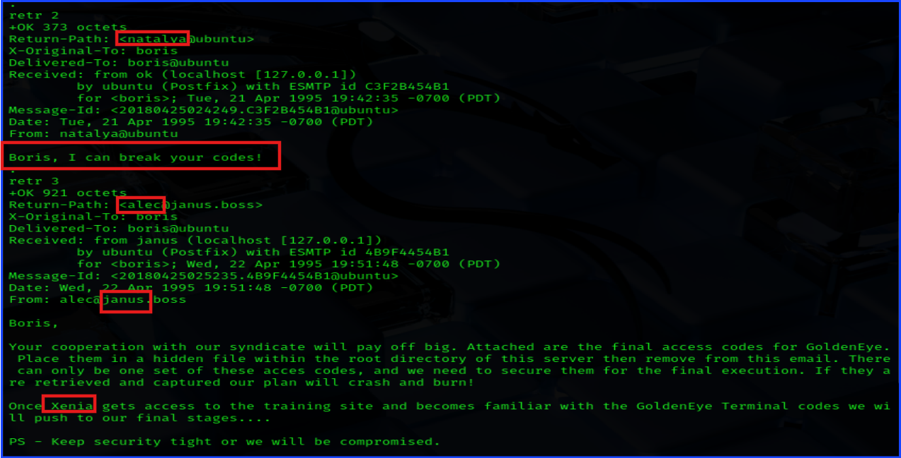

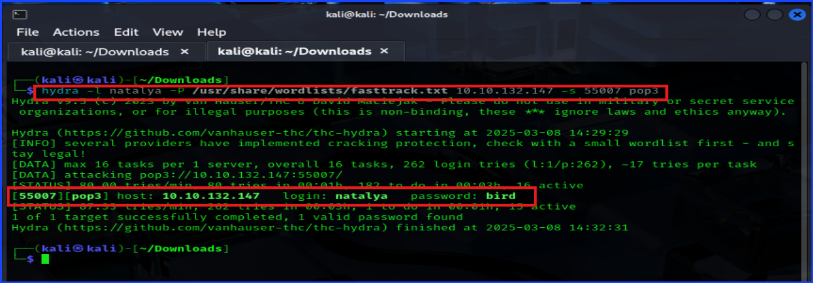

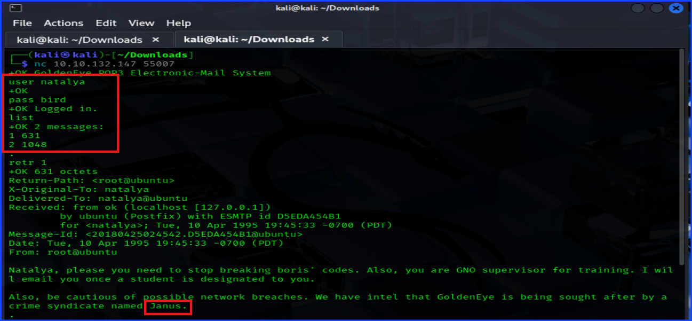

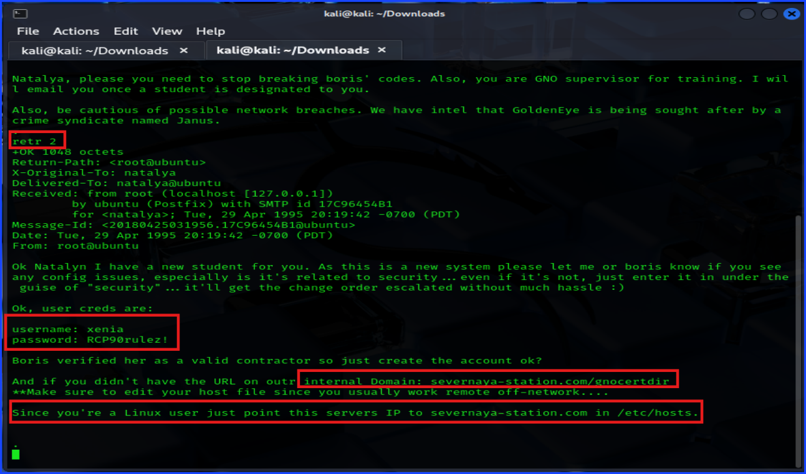

**Remediation:** Steps to fix or mitigate the vulnerability.

---

**Finding 3:** Security by Obsecurity

**Description:** A detailed description of the vulnerability.

**Risk:** How this vulnerability could affect the system.

+ **Likelyhood:**
  
+ **Impact:**

**Tool Used:** [toolName]

**Evidence:**

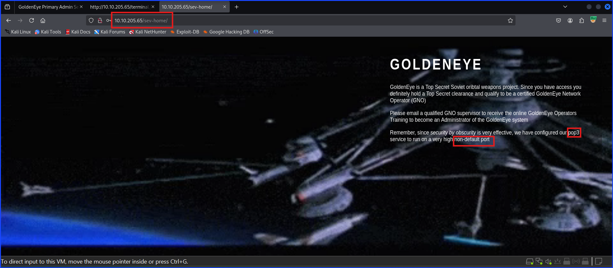

**Remediation:** Steps to fix or mitigate the vulnerability.

### Exploitation

### Maintain Access

### House Cleaning

---

## Additional Information

---

**Sangsongthong**
| Hexterika Cyber Lab
| CEO, Founder, and Sole Worker
