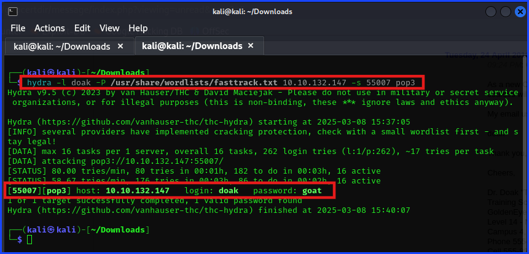
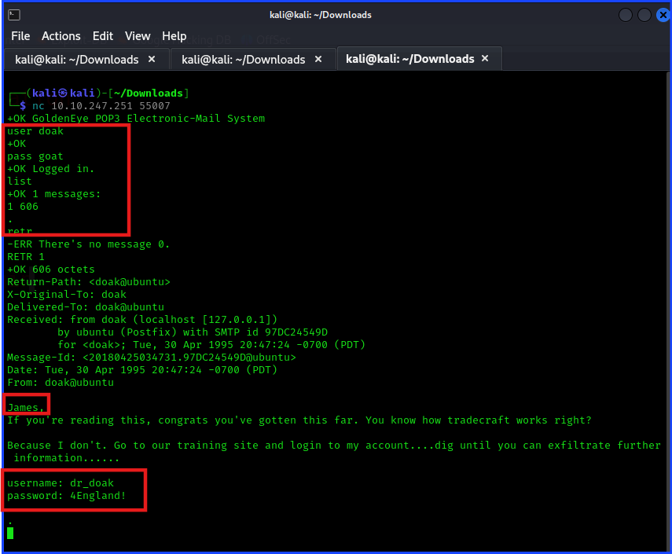
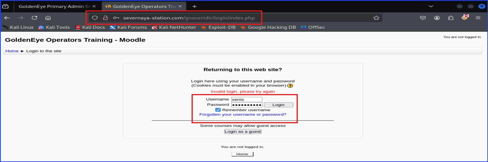
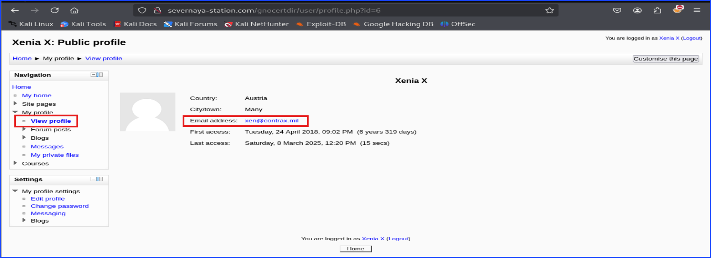

# Hexterika Cyber Lab

## Penetration Testing Report

***Client Name:*** Severnaya Auxillary Control Station TryHackMe
***Date:*** 23 March 2025
***Version:*** 1.0

## Tables of Content

1. Confidentiality Statement
2. Disclaimer
3. Contact Information
4. Finding Severity Ratings
5. Executive Summary
6. Test Scope
7. Methodologies
8. Additional Information

## Confidentiality Statement

This document is the exclusive property of Severnaya Auxillary Control Station and Hexterika Cyber Lab. This document contains proprietary and confidential information. Duplication, redistribution, or use, in whole or in part, in any form, requires consent of both Severnaya Auxillary Control Station and Hexterika Cyber Lab.

Severnaya Auxiliary Control Station may share this document with auditors under non-disclosure agreements to demonstrate penetration test requirement compliance.

## Disclaimer

A penetration test is considered a snapshot in time. The findings and recommendations reflect the information gathered during the assessment and not any changes or modifications made outside of that period.

Time-limited engagements do not allow for a full evaluation of all security controls. Hexterika Cyber Lab prioritized the assessment to identify the weakest security controls an attacker would exploit. Hexterika Cyber Lab recommends conducting similar assessments on an annual basis by internal or third-party assessors to ensure the continued success of the controls.

---

## Contact Information

**Company:** Severnaya Auxillary Control Station

| **Name** | **Title** | **Contact Information** |
| :------: | :-------: | :---------------------: |
| Natalia  | Global Information Security Manager | Email: [ns@na.goldeneye](ns@na.goldeneye)|

**Company:** Hexterika Cyber Lab

| **Name** | **Title** | **Contact Information** |
| :------: | :-------: | :---------------------: |
| Sangsongthong C. | Penetration Tester | Email: [sangsongthong.c@hexterika-cyber-lab.work.gd](sangsongthong.c@hexterika-cyber-lab.work.gd) |

---

## Finding Severity Ratings

**Risk Factors** Risk is measured by two factors: Likelihood and Impact:

+ **Likelihood**

Likelihood measures the potential of a vulnerability being exploited. Ratings are given based on the difficulty of the attack, the available tools, attacker skill level, and client environment.

+ **Impact**

Impact measures the potential vulnerability’s effect on operations, including confidentiality, integrity, and availability of client systems and/or data, reputational harm, and financial loss.

---

## Executive Summary

Summary of Findings: Brief overview of critical findings.

Risk Level: High/Medium/Low (based on your findings).

Key Recommendations: Highlight main actions for the client.

---

## Test Scope

**Target Systems:**

+ 10.x.x.x (TryHackMe's Machine IPs changed every time that I access it but the inside are the same.)

**Scope Exclusions:**

Per client request, Hexterika Cyber Lab did not perform any of the following attacks during testing:

+ Denial of Service (DoS)

+ Phishing/Social Engineering

All other attacks not specified above were permitted by Severnaya Auxillary Control Station.

**Client Allowances:**

+ Internal access to network via VPN

**Testing Period:** 1 March 2025 - 4 March 2025

---

## Methodology

### Technical Findings

**Finding 1:** Information Leakage - Exposed Login Information and User Credentials

**Description:**

The system exposes sensitive information through multiple channels:

+ The landing page reveals the login URL, and partially obfuscates the username by displaying it as `username: UNKNOWN`. This exposes potential attack vectors for unauthorized login attempts.

+ The source code of the page, after being redirected to a .js file, leaks additional sensitive information. Specifically:

  + Usernames for Boris, Natalya, and Admin are exposed.

  + A message from the Admin to Boris instructs him to change his default password to an encoded one, which can be decoded by an attacker.

  + The encoded password and usernames are valuable for unauthorized access and further information gathering.

**Risk:**

+ **Likelyhood:** Very High
  + Both the exposed login URL and the usernames are easily accessible, allowing attackers to attempt unauthorized login or use this information for further attacks.
  + The exposed encoded password can easily be decoded and used to gain access to the Boris account.
  
+ **Impact:** High
  + An attacker could gain unauthorized access to Boris's account, which could lead to further reconnaissance or escalation.
  + The exposed usernames for `Admin` and `Natalya` provide additional targets for attack, increasing the potential for lateral movement or data compromise.

**Tool Used:** `nc`, Burp Suite Smart Decoder

**Evidence:**

**Remediation:**

+ Remove Sensitive Information from the Landing Page

  + Do not expose the login URL or any username-related information directly on the landing page.

  + Ensure that usernames are not partially revealed, even in an obfuscated form.

+ Restrict Access to the Source Code

  + Prevent sensitive data from being included in publicly accessible JavaScript files.

  + Store credentials securely in the backend, not in client-side code.

+ Use Secure Credential Management

  + Do not hardcode or encode passwords in any publicly accessible file.

  + Use environment variables or a secure vault for storing credentials.

+ Implement Least Privilege and Secure Defaults

  + Default credentials should never be used. Ensure that all accounts require a password reset on first login.

  + Enforce strong password policies and require users to change their passwords regularly.

+ Monitor for Information Exposure

  + Regularly review public-facing code and web pages for unintentional information leakage.

  + Use automated tools to scan for sensitive data exposure.

---

**Finding 2:** Weak Authentication - POP3 Password Brute-Force and Unauthorized Email Access

**Description:**

The POP3 service was identified and accessed by capturing its banner using Netcat (nc). A password brute-force attack was performed using a common wordlist, resulting in the successful authentication of multiple user accounts, including Boris.

Upon gaining access to Boris’s email, additional usernames were enumerated, expanding the potential attack surface. Further brute-force attempts on other discovered accounts, such as Natalya and Dr. Doak, were also successful, allowing unauthorized access to their email contents. These emails contained sensitive information, including login credentials for other services.

Although Boris did not reuse his password across different systems, the exposed credentials facilitated further unauthorized access, demonstrating the risk of weak authentication mechanisms.

**Risk:**

+ **Likelyhood:** High
  + The attack was successful using a common wordlist, indicating weak password policies. Attackers can easily brute-force accounts if strong authentication controls are not in place.
  
+ **Impact:** High
  + Unauthorized access to email accounts allowed for further enumeration of usernames and credentials, leading to potential compromise of other systems. Sensitive information, including login credentials for different services, was exposed.

**Tool Used:** `hydra`, Firefox, `nc`

**Evidence:**

**Remediation:**

+ Enforce strong password policies, requiring complex passwords that are resistant to brute-force attacks.

+ Implement account lockout mechanisms or rate-limiting to prevent repeated failed login attempts.

+ Require multi-factor authentication (MFA) for accessing email services.

+ Monitor and log authentication attempts to detect and respond to brute-force attacks.

---

**Finding 3:** Credentials Exposed in Plaintext via Email

**Description:**

Multiple user credentials were identified in plaintext within email communications. By successfully authenticating to the POP3 service through brute-force attacks, it was possible to access emails containing login credentials.

Specifically:

+ Xenia’s Moodle credentials were disclosed in an email instructing the recipient to modify their host file to access the Moodle instance.

+ Dr. Doak’s Moodle credentials were found in an email, where Dr. Doak explicitly shared his login details with an external threat actor, aiding unauthorized access to the system.

The exposure of login credentials in plaintext within email communications presents a significant security risk, as attackers can leverage these credentials to gain unauthorized access to internal systems without the need for further exploitation techniques such as credential stuffing or brute-force attacks.

**Risk:**

+ **Likelyhood:** Very High
  + An attacker with access to compromised email accounts can directly obtain valid credentials without additional effort.
  
+ **Impact:** Very High
  + Unauthorized access to internal systems can lead to further compromise, unauthorized data access, and privilege escalation.

**Tool Used:** `nc`, Firefox

**Evidence:**

**Remediation:**

+ Enforce a strict policy prohibiting the transmission of credentials via email.

+ Implement security controls to automatically detect and block the transmission of plaintext credentials.

+ Introduce a secure password management solution for credential sharing.

+ Require users to change passwords immediately if credentials are found to have been shared via email.

+ Implement multi-factor authentication (MFA) to mitigate unauthorized access risks.

+ Conduct security awareness training for employees regarding secure credential management practices.

---

**Finding 4:** Insider Credential Leak & Unauthorized Account Sharing

**Description:**

During the assessment, it was discovered that Dr. Doak, an internal user, was actively leaking company credentials to an external party (James). This was identified through an email exchange in which Dr. Doak explicitly provided his Moodle credentials in plaintext. This type of insider activity poses a severe security risk, as it grants unauthorized individuals access to internal systems without requiring external attack methods such as brute-force or phishing.

**Risk:**

+ **Likelyhood:** High
  + An insider willingly leaking credentials means security mechanisms like password complexity or account lockout policies are ineffective.
  
+ **Impact:** Critical
  + Unauthorized access to corporate systems enables external attackers to escalate privileges, access sensitive data, and disrupt operations.

**Tool Used:** Firefox

**Evidence:**

**Remediation:**

+ Implement strict access control policies to limit user privileges based on role and necessity.

+ Enforce security training and awareness programs to educate employees about the dangers of credential sharing.

+ Monitor and audit internal communications for suspicious activity, such as credential sharing in emails.

+ Implement Data Loss Prevention (DLP) solutions to detect and prevent the transmission of sensitive credentials over emails.

---

**Finding 5:** Data Exfiltration via Image File

**Description:**

As part of the investigation, it was discovered that Dr. Doak was involved in an insider data exfiltration operation. The exfiltrated data was embedded within an image file, for-007.jpg, which was found during an analysis of Dr. Doak's Moodle account. The image was initially referenced within the system and ultimately led to the extraction of sensitive credentials.

Upon downloading and analyzing the file with ExifTool, an encoded message was revealed that contained admin-level credentials. These credentials provided unauthorized access to the system, demonstrating a significant security vulnerability in the exfiltration of data through seemingly innocent files.

**Risk:**

+ **Likelyhood:** High
  + Exfiltration through easily overlooked files like images is a common tactic used by insiders or attackers to bypass security controls.
  
+ **Impact:** Critical
  + The exfiltrated data contained admin credentials, enabling an attacker to gain full control of the system, compromising sensitive data and operations.

**Tool Used:** Firefox, `hydra`, `nc`

**Evidence:** Insert screenshots

**Remediation:**

+ Implement strong file integrity monitoring and content inspection for all file uploads and downloads, particularly images and documents.

+ Use encryption and access control policies for sensitive data, ensuring only authorized individuals can access it.

+ Regularly audit system logs to detect unauthorized or suspicious file access and potential data exfiltration activities.

+ Educate users about the potential risks associated with embedding sensitive information in non-obvious places, such as image files.

---

**Finding 6:** POP3 Credential Disclosure & User Information Discovery

**Description:**

Once an attacker successfully compromises a user’s account, they gain access to all information available to that user. In this case, after logging in as Xenia, her registered email address was accessible, along with any data or communication she had permission to view.

This security weakness increases the potential damage from credential theft, session hijacking, or phishing attacks, as the attacker can masquerade as the legitimate user and access sensitive internal information.

**Risk:** How this vulnerability could affect the system.

+ **Likelyhood:** High
  + If user credentials are compromised (e.g., through brute force, phishing, or plaintext exposure), an attacker can log in and fully assume the user's identity.
  
+ **Impact:**  High
  + Unauthorized access could lead to further reconnaissance, data exfiltration, and privilege escalation if the compromised account has access to additional systems.

**Tool Used:** Firefox

**Evidence:** Insert screenshots

**Remediation:**

Implement Multi-Factor Authentication (MFA) to reduce the risk of account compromise.

Restrict session duration and enforce automatic logout after a period of inactivity to reduce session hijacking risks.

Monitor and log unusual login activities (e.g., logins from unexpected locations or devices) and alert users to suspicious activity.

Educate users on phishing risks to prevent credential theft through social engineering.

---

**Finding 8:** POP3 Credential Disclosure & User Information Discovery

**Description:**

**Risk:** How this vulnerability could affect the system.

+ **Likelyhood:**
  
+ **Impact:**

**Tool Used:** [toolName]

**Evidence:** Insert screenshots

**Remediation:** Steps to fix or mitigate the vulnerability.

---

**Finding 9:** POP3 Credential Disclosure & User Information Discovery

**Description:**

**Risk:** How this vulnerability could affect the system.

+ **Likelyhood:**
  
+ **Impact:**

**Tool Used:** [toolName]

**Evidence:** Insert screenshots

**Remediation:** Steps to fix or mitigate the vulnerability.

---

**Finding 10:** POP3 Credential Disclosure & User Information Discovery

**Description:**

**Risk:** How this vulnerability could affect the system.

+ **Likelyhood:**
  
+ **Impact:**

**Tool Used:** [toolName]

**Evidence:** Insert screenshots

**Remediation:** Steps to fix or mitigate the vulnerability.

---

**Finding 11:** POP3 Credential Disclosure & User Information Discovery

**Description:**

**Risk:** How this vulnerability could affect the system.

+ **Likelyhood:**
  
+ **Impact:**

**Tool Used:** [toolName]

**Evidence:** Insert screenshots

**Remediation:** Steps to fix or mitigate the vulnerability.

---

## Additional Information

---

**Sangsongthong**
| Hexterika Cyber Lab
| CEO, Founder, and Sole Worker
