# Hexterika Cyber Lab

## Penetration Testing Report

***Client Name:*** Severnaya Auxillary Control Station TryHackMe
***Date:*** 23 March 2025
***Version:*** 1.0

## Tables of Content

1. Confidentiality Statement
2. Disclaimer
3. Contact Information
4. Finding Severity Ratings
5. Executive Summary
6. Test Scope
7. Methodologies
8. Additional Information

## Confidentiality Statement

This document is the exclusive property of Severnaya Auxillary Control Station and Hexterika Cyber Lab. This document contains proprietary and confidential information. Duplication, redistribution, or use, in whole or in part, in any form, requires consent of both Severnaya Auxillary Control Station and Hexterika Cyber Lab.

Severnaya Auxiliary Control Station may share this document with auditors under non-disclosure agreements to demonstrate penetration test requirement compliance.

## Disclaimer

A penetration test is considered a snapshot in time. The findings and recommendations reflect the information gathered during the assessment and not any changes or modifications made outside of that period.

Time-limited engagements do not allow for a full evaluation of all security controls. Hexterika Cyber Lab prioritized the assessment to identify the weakest security controls an attacker would exploit. Hexterika Cyber Lab recommends conducting similar assessments on an annual basis by internal or third-party assessors to ensure the continued success of the controls.

---

## Contact Information

**Company:** Severnaya Auxillary Control Station

| **Name** | **Title** | **Contact Information** |
| :------: | :-------: | :---------------------: |
| Natalia  | Global Information Security Manager | Email: [ns@na.goldeneye](ns@na.goldeneye)|

**Company:** Hexterika Cyber Lab

| **Name** | **Title** | **Contact Information** |
| :------: | :-------: | :---------------------: |
| Sangsongthong C. | Penetration Tester | Email: [sangsongthong.c@hexterika-cyber-lab.work.gd](sangsongthong.c@hexterika-cyber-lab.work.gd) |

---

## Finding Severity Ratings

**Risk Factors** Risk is measured by two factors: Likelihood and Impact:

+ **Likelihood**

Likelihood measures the potential of a vulnerability being exploited. Ratings are given based on the difficulty of the attack, the available tools, attacker skill level, and client environment.

+ **Impact**

Impact measures the potential vulnerability’s effect on operations, including confidentiality, integrity, and availability of client systems and/or data, reputational harm, and financial loss.

---

## Executive Summary

Here are the overview of critical findings.

+ A discovery of an insider threat: There were some evidence of an employee intentionally leaking their credential to help an outsider to come side your company's system.

+ Admin's password breached: This lead to administrator account compromisation.

+ Leak credentials.

+ RCE vulnerability from the plugin, Aspenll.

---

## Test Scope

**Target Systems:**

+ 10.x.x.x (TryHackMe's Machine IPs changed every time that I access it but the inside are the same.)

**Scope Exclusions:**

Per client request, Hexterika Cyber Lab did not perform any of the following attacks during testing:

+ Denial of Service (DoS)

+ Phishing/Social Engineering

All other attacks not specified above were permitted by Severnaya Auxillary Control Station.

**Client Allowances:**

+ Internal access to network via VPN

**Testing Period:** 1 March 2025 - 4 March 2025

---

## Methodology

### Technical Findings

**Finding 1:** Information Leakage - Exposed Login Information and User Credentials

**Description:**

The system exposes sensitive information through multiple channels:

+ The landing page reveals the login URL, and partially obfuscates the username by displaying it as `username: UNKNOWN`. This exposes potential attack vectors for unauthorized login attempts.

+ The source code of the page, after being redirected to a .js file, leaks additional sensitive information. Specifically:

  + Usernames for Boris, Natalya, and Admin are exposed.

  + A message from the Admin to Boris instructs him to change his default password to an encoded one, which can be decoded by an attacker.

  + The encoded password and usernames are valuable for unauthorized access and further information gathering.

**Risk:**

+ **Likelyhood:** Very High
  + Both the exposed login URL and the usernames are easily accessible, allowing attackers to attempt unauthorized login or use this information for further attacks.
  + The exposed encoded password can easily be decoded and used to gain access to the Boris account.
  
+ **Impact:** High
  + An attacker could gain unauthorized access to Boris's account, which could lead to further reconnaissance or escalation.
  + The exposed usernames for `Admin` and `Natalya` provide additional targets for attack, increasing the potential for lateral movement or data compromise.

**Tool Used:** `nc`, Burp Suite Smart Decoder

**Evidence:**

**Remediation:**

+ Remove Sensitive Information from the Landing Page

  + Do not expose the login URL or any username-related information directly on the landing page.

  + Ensure that usernames are not partially revealed, even in an obfuscated form.

+ Restrict Access to the Source Code

  + Prevent sensitive data from being included in publicly accessible JavaScript files.

  + Store credentials securely in the backend, not in client-side code.

+ Use Secure Credential Management

  + Do not hardcode or encode passwords in any publicly accessible file.

  + Use environment variables or a secure vault for storing credentials.

+ Implement Least Privilege and Secure Defaults

  + Default credentials should never be used. Ensure that all accounts require a password reset on first login.

  + Enforce strong password policies and require users to change their passwords regularly.

+ Monitor for Information Exposure

  + Regularly review public-facing code and web pages for unintentional information leakage.

  + Use automated tools to scan for sensitive data exposure.

---

**Finding 2:** Weak Authentication - POP3 Password Brute-Force and Unauthorized Email Access

**Description:**

The POP3 service was identified and accessed by capturing its banner using Netcat (nc). A password brute-force attack was performed using a common wordlist, resulting in the successful authentication of multiple user accounts, including Boris.

Upon gaining access to Boris’s email, additional usernames were enumerated, expanding the potential attack surface. Further brute-force attempts on other discovered accounts, such as Natalya and Dr. Doak, were also successful, allowing unauthorized access to their email contents. These emails contained sensitive information, including login credentials for other services.

Although Boris did not reuse his password across different systems, the exposed credentials facilitated further unauthorized access, demonstrating the risk of weak authentication mechanisms.

**Risk:**

+ **Likelyhood:** High
  + The attack was successful using a common wordlist, indicating weak password policies. Attackers can easily brute-force accounts if strong authentication controls are not in place.
  
+ **Impact:** High
  + Unauthorized access to email accounts allowed for further enumeration of usernames and credentials, leading to potential compromise of other systems. Sensitive information, including login credentials for different services, was exposed.

**Tool Used:** `hydra`, Firefox, `nc`

**Evidence:**

**Remediation:**

+ Enforce strong password policies, requiring complex passwords that are resistant to brute-force attacks.

+ Implement account lockout mechanisms or rate-limiting to prevent repeated failed login attempts.

+ Require multi-factor authentication (MFA) for accessing email services.

+ Monitor and log authentication attempts to detect and respond to brute-force attacks.

---

**Finding 3:** Credentials Exposed in Plaintext via Email

**Description:**

Multiple user credentials were identified in plaintext within email communications. By successfully authenticating to the POP3 service through brute-force attacks, it was possible to access emails containing login credentials.

Specifically:

+ Xenia’s Moodle credentials were disclosed in an email instructing the recipient to modify their host file to access the Moodle instance.

+ Dr. Doak’s Moodle credentials were found in an email, where Dr. Doak explicitly shared his login details with an external threat actor, aiding unauthorized access to the system.

The exposure of login credentials in plaintext within email communications presents a significant security risk, as attackers can leverage these credentials to gain unauthorized access to internal systems without the need for further exploitation techniques such as credential stuffing or brute-force attacks.

**Risk:**

+ **Likelyhood:** Very High
  + An attacker with access to compromised email accounts can directly obtain valid credentials without additional effort.
  
+ **Impact:** Very High
  + Unauthorized access to internal systems can lead to further compromise, unauthorized data access, and privilege escalation.

**Tool Used:** `nc`, Firefox

**Evidence:**

**Remediation:**

+ Enforce a strict policy prohibiting the transmission of credentials via email.

+ Implement security controls to automatically detect and block the transmission of plaintext credentials.

+ Introduce a secure password management solution for credential sharing.

+ Require users to change passwords immediately if credentials are found to have been shared via email.

+ Implement multi-factor authentication (MFA) to mitigate unauthorized access risks.

+ Conduct security awareness training for employees regarding secure credential management practices.

---

**Finding 4:** Insider Credential Leak & Unauthorized Account Sharing

**Description:**

During the assessment, it was discovered that Dr. Doak, an internal user, was actively leaking company credentials to an external party (James). This was identified through an email exchange in which Dr. Doak explicitly provided his Moodle credentials in plaintext. This type of insider activity poses a severe security risk, as it grants unauthorized individuals access to internal systems without requiring external attack methods such as brute-force or phishing.

**Risk:**

+ **Likelyhood:** High
  + An insider willingly leaking credentials means security mechanisms like password complexity or account lockout policies are ineffective.
  
+ **Impact:** Critical
  + Unauthorized access to corporate systems enables external attackers to escalate privileges, access sensitive data, and disrupt operations.

**Tool Used:** Firefox

**Evidence:**

**Remediation:**

+ Revoke all access to the company from Dr. Doak and arrest him.

+ Monitor and audit internal communications for suspicious activity, such as credential sharing in emails.

---

**Finding 5:** Data Exfiltration via Image File

**Description:**

As part of the investigation, it was discovered that Dr. Doak was involved in an insider data exfiltration operation. There was an evidence of him, under the account name `doak`, sending an email to an outsider, James, instructing him to login to his account to retrieve a secret file he hid in his account like a normal file.

That file was found during an analysis of Dr. Doak's Moodle account. Insider the secret file, there was an instruction for James, the outsider, to navigate to a specific URL to retrieve an image file `for-007.jpg` in which he claimed it contained admin credential.

**Risk:**

+ **Likelyhood:** High
  + Exfiltration through easily overlooked files like images is a common tactic used by insiders or attackers to bypass security controls.
  
+ **Impact:** Critical
  + The exfiltrated data contained admin credentials, enabling an attacker to gain full control of the system, compromising sensitive data and operations.

**Tool Used:** Firefox, `nc`

**Evidence:**

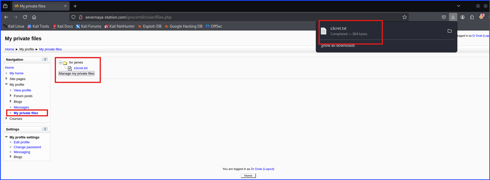

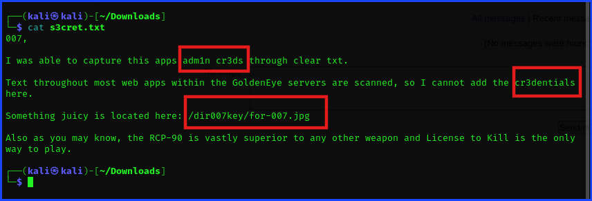

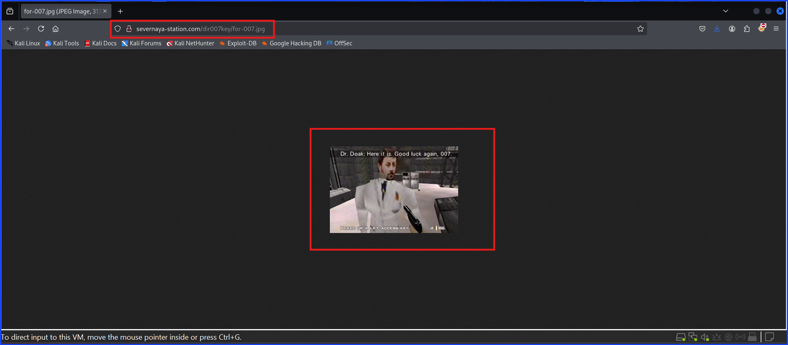

**Remediation:**

+ Revoke all access to the company from Dr. Doak and arrest him.

---

**Finding 6:** Extraction of Admin Credentials via Steganographic Encoding in Image File

**Description:**

During the assessment, an image file named for-007.jpg was identified as containing encoded information. Using ExifTool, metadata analysis revealed an encoded message embedded within the file. This message was decoded using Burp Suite’s decoder, revealing the Admin's password.

With these credentials, an attacker could log into the Moodle platform as an admin user, gaining access to sensitive user data, including the ability to modify settings, view all users, and further escalate privileges within the system.

**Risk:**

+ **Likelyhood:** High
  + Since an attacker with access to the file could extract and decode the credentials without requiring prior privilege escalation.
  
+ **Impact:** Critical
  + Admin credentials allow full control over Moodle, including user management, configuration changes, and potential code execution.

**Tool Used:** Burp Suite Decoder, `exiftool`

**Evidence:**

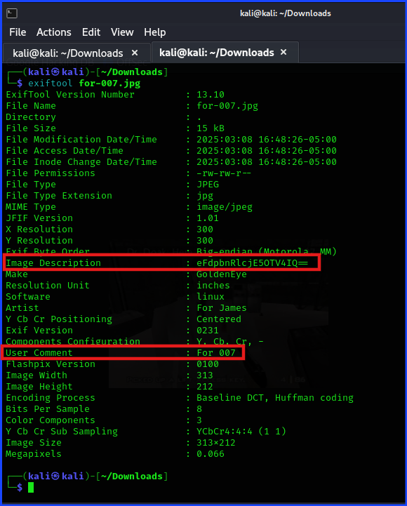

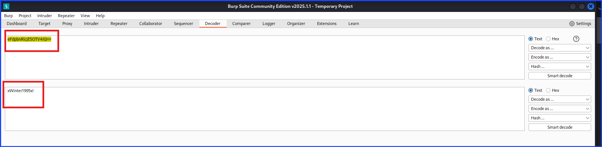

**Remediation:**

+ Revoke all access to the company from Dr. Doak and arrest him.

+ Change admin account's password to prevent further breach.

+ Check all the system to see what damages has been done to the system such as sensitive company's data and password of something highly valuable being stolen or some changes inside the system.

+ Inform high-profile clients and key stakeholders about the breach, including any potential data exposure and mitigation steps being taken.

---

**Finding 7:** Remote Code Execution via Moodle's Aspell Plugin

**Description:**

Upon logging in as the admin user, it was identified that Moodle's Aspell spell checker plugin allowed arbitrary code execution. By modifying the Aspell path setting, an attacker could inject a Python reverse shell payload.

After making the modification, the payload was triggered when attempting to spell-check content within Moodle's blog post editor. This resulted in the establishment of a reverse shell connection, allowing full system access as the web application user.

**Risk:**

+ **Likelyhood:** High
  + The vulnerability exists within Moodle's configuration, and an attacker with admin credentials can easily exploit it.
  
+ **Impact:** Critical
  + Successful exploitation results in remote command execution (RCE), allowing full control of the underlying system.

**Tool Used:** `nc`, Moodle Aspell Plugin (Abused for Command Execution), Python Reverse Shell Exploit

**Evidence:**

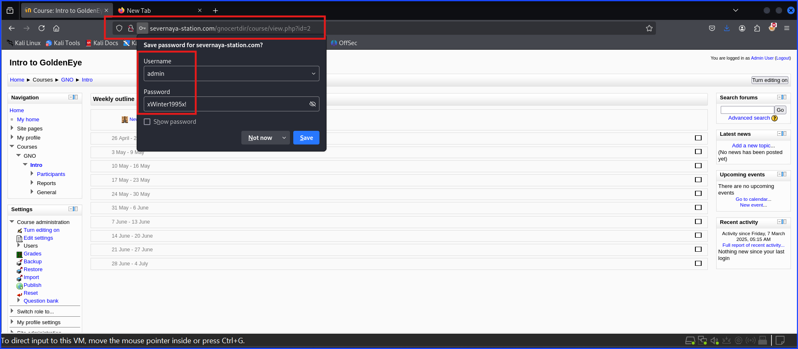

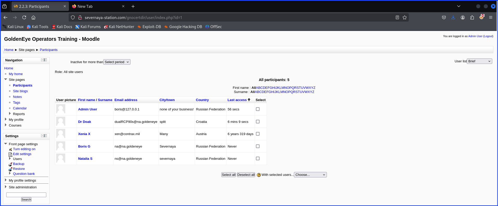

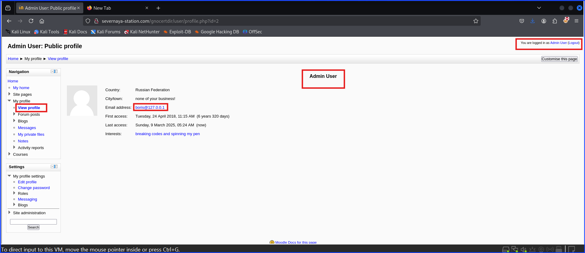

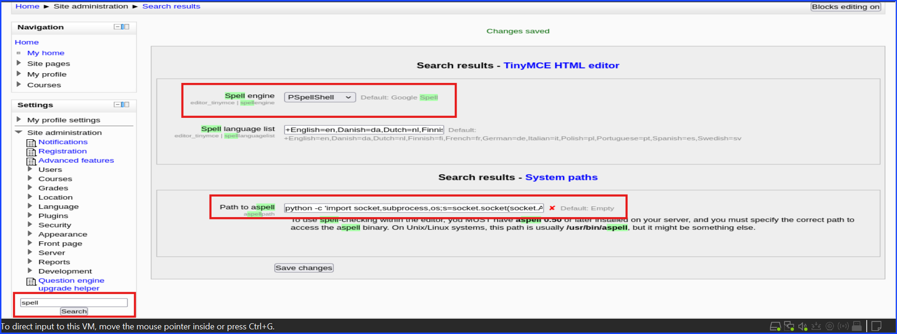

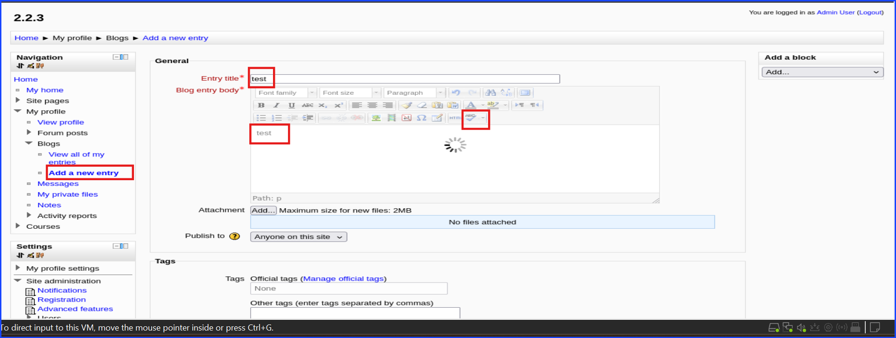

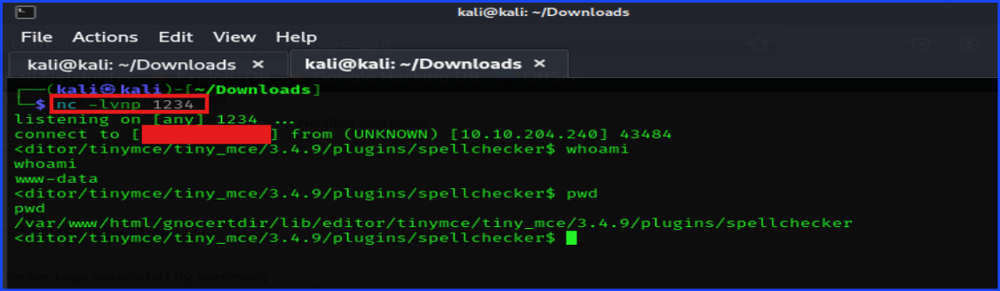

**Remediation:**

+ Enforce Multi-Factor Authentication (MFA) for all privileged accounts to prevent unauthorized access even if credentials are leaked.

+ Implement login alerts to notify administrators of suspicious login attempts, especially from unknown locations or devices.

+ Enable logging and monitoring for admin account activity to detect unusual access patterns, such as logins from unexpected locations or devices.

+ Disable unnecessary plugins: If Aspell isn’t needed, remove or disable it to eliminate the attack vector.

---

**Finding 8:** Allowing Download from HTTP Without Antivirus Scanning for Exploit Files

**Description:**

The system allows files to be downloaded via HTTP without any secure transmission (HTTP instead of HTTPS) and without antivirus scanning or malware detection for files. An attacker could use this to deliver exploit files or malicious payloads to the system, potentially leading to further exploitation.

**Risk:**

+ **Likelyhood:** High
  + The lack of secure file transfer protocols (such as HTTPS) makes it easier for attackers to exploit this weakness and deliver malicious files. Furthermore, the absence of antivirus scanning increases the likelihood of malicious payloads being executed.
  
+ **Impact:** Critical
  + Privilege Escalation: Malicious files could be used to escalate privileges, gaining unauthorized access to the system.

  + System Compromise: Exploit files could compromise the system, leading to full control of the target machine, potentially resulting in data theft, backdoor installation, or further system exploitation.

**Tool Used:** python web server, exploit file

**Evidence:**

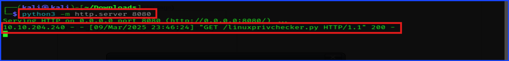

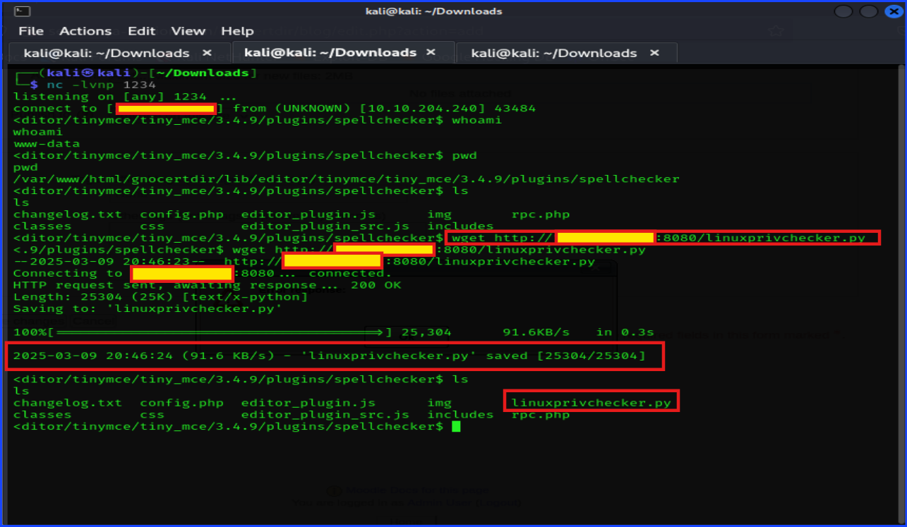

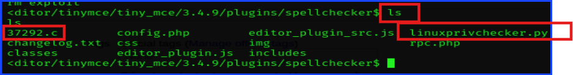

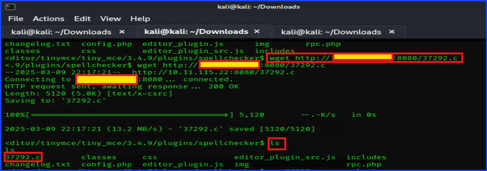

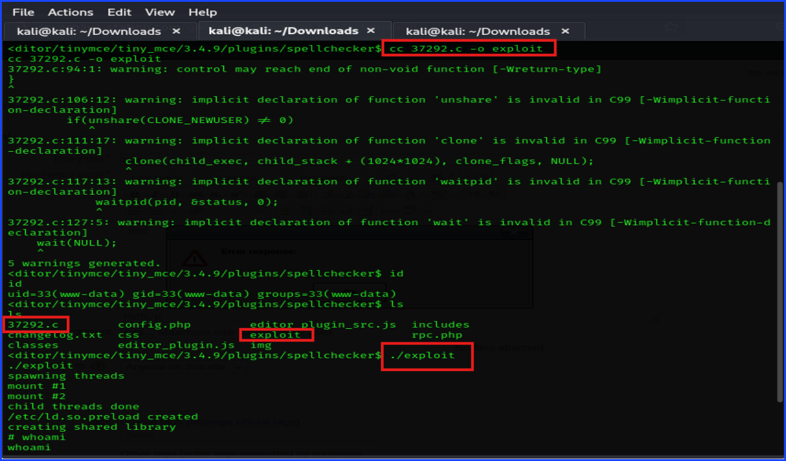

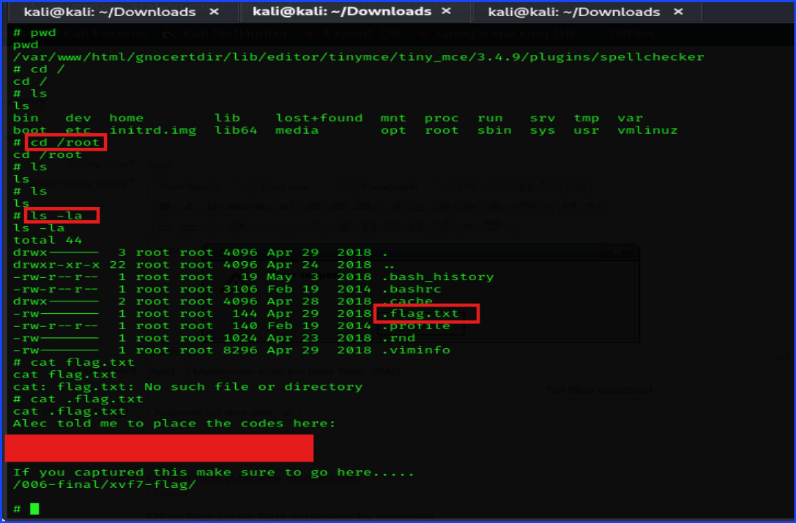

**Remediation:**

+ Restrict file downloads to trusted sources and ensure that any file transfer process is secured to prevent unauthorized files from being delivered.

+ Use secure file transfer protocols like HTTPS to protect file integrity during transmission, even though MITM wasn’t performed here. Ensuring encrypted file transfers would help making unauthorized users from sending potentially harmful files more difficult.

+ Scan files for malicious content before allowing their download or execution.

+ Use a combination of antivirus software and a host-based IPS to provide layered protection. Ensure both systems are updated regularly with the latest signatures and detection rules.

---

## Additional Information

Here are the credentials leaked that I got from POP3 brute-forcing.

| User | Username | Password |
| :--: | :------: | :------: |
| Boris | boris | secret1! |
| Natalie | natalya | bird |
| Doak | doak | goat |

Evidences:

Here is Boris's GoldenEye login credential.

| User | Username | Password |
| :--: | :------: | :------: |
| Boris | boris | InvincibleHack3r |

Evidence:

Here is the credentials leaked in plaintext.

---

**Author & Publisher:** Sangsongthong Chantaranothai

**Date Published:** March 28, 2025
*(Based on the commit where the full walkthrough was completed. Later commits are minor edits or additions.)*

**Purpose:** Created as part of ongoing professional development to earn CEU/CPE credits for CompTIA and ISC2 certifications. Also intended to showcase cybersecurity skills, support Hexterika Cyberlab's portfolio, and demonstrate project quality to future clients and employers.

***Published as part of Hexterika Cyberlab, the cybersecurity division of Hexterika Breaks Free.***

🔐 Part of the **Hexterika Cyberlab** project series  
📎 Website coming soon at **Hexterika Breaks Free**
