# Mock Penetration Testing Report Based On GoldenEye Room On TryHackMe Lab

---

## Hexterika Cyberlab

## Penetration Testing Report

***Client Name:*** Severnaya Auxiliary Control Station TryHackMe  
***Date:*** 19 August 2025  
***Version:*** 1.1 polished

## Tables of Content

1. Confidentiality Statement
2. Disclaimer
3. Legal & Data Handling
4. Contact Information
5. Executive Summary
6. Test Scope
7. Methodology
8. Technical Findings
9. Additional Information

## Confidentiality Statement

This document is the exclusive property of Severnaya Auxillary Control Station and Hexterika Cyber Lab. This document contains proprietary and confidential information. Duplication, redistribution, or use, in whole or in part, in any form, requires consent of both Severnaya Auxillary Control Station and Hexterika Cyberlab.

Severnaya Auxiliary Control Station may share this document with auditors under non-disclosure agreements to demonstrate penetration test requirement compliance.

## Disclaimer

A penetration test is considered a snapshot in time. The findings and recommendations reflect the information gathered during the assessment and not any changes or modifications made outside of that period.

Time-limited engagements do not allow for a full evaluation of all security controls. Hexterika Cyberlab prioritized the assessment to identify the weakest security controls an attacker would exploit. Hexterika Cyberlab recommends conducting similar assessments on an annual basis by internal or third-party assessors to ensure the continued success of the controls.

### AI Assistance Disclosure

Parts of this report were refined using AI-assisted technical writing tools (ChatGPT). All technical testing, analysis, and findings were conducted by Hexterika Cyberlab. AI assistance was used strictly for editing, phrasing, and improving clarity — not for technical exploitation or data collection.

## Legal & Data Handling

+ This report contains mock data unless noted otherwise.
+ Real client data will not be shared publicly without written consent.
+ Sensitive data will be anonymized, redacted (e.g., Username: [REDACTED], Password: ********), or substituted with mock data before being posted publicly.
+ Clients are entitled to up to [X] revisions. The final revision (e.g., Revision #5 for a 5-revision package) is considered the final delivery unless the client:
  + Accepts an earlier draft
  + Purchases additional revisions.
+ During the engagement, all client data will be securely stored in encrypted and access-controlled environments to prevent unauthorized access. This includes:
  + Storing client data on encrypted local or cloud storage that is password-protected.
  + Limiting access to the data to only myself and the client. In the case of a legal requirement (e.g., court order), I will comply with applicable laws for data sharing.+ Using strong, unique passwords and enabling multi-factor authentication (MFA) for any accounts or systems where client data is stored.
+ Upon final delivery, all sensitive files will be handed over to the client.
+ All sensitive data will be securely deleted from Hexterika Cyberlab's system within [X days] after full payment is received, or in accordance with the terms specified for the relevant Fiverr package or custom agreement.
+ This engagement was conducted through Fiverr. All payments, revisions, and deliveries comply with Fiverr's terms of service.

---

## Contact Information

**Company:** Severnaya Auxillary Control Station

| **Name** | **Title** | **Contact Information** |
| :------: | :-------: | :---------------------: |
| Natalya | Global Information Security Manager | Email: [ns@na.goldeneye](ns@na.goldeneye) |

**Company:** Hexterika Cyberlab

| **Name** | **Title** | **Contact Information** |
| :------: | :-------: | :---------------------: |
| Sangsongthong C. | Penetration Tester | Email: [contact@example.com](contact@example.com) |

---

## Finding Severity Ratings

**Risk Factors** Risk is measured by two factors: Likelihood and Impact:

+ **Likelihood**

Likelihood measures the potential of a vulnerability being exploited. Ratings are given based on the difficulty of the attack, the available tools, attacker skill level, and client environment.

+ **Impact**

Impact measures the potential vulnerability’s effect on operations, including confidentiality, integrity, and availability of client systems and/or data, reputational harm, and financial loss.

| Ratings  | Description                                         |
|:--------:|:---------------------------------------------------:|
| Low      | Unlikely to be exploited; minimal impact            |
| Moderate | Exploitable with effort; some impact                |
| High     | Likely to be exploited; major impact                |
| Critical | Easily exploitable; full system compromise possible |

---

## Executive Summary

Here are the overview of critical findings.

The assessment of Severnaya Auxiliary Control Station’s infrastructure revealed multiple critical vulnerabilities that jeopardize operational integrity, user data confidentiality, and administrative control. The most severe risks include compromised administrative credentials, insider threat behavior, and remote code execution capabilities.

Immediate focus should be placed on strengthening credential security, implementing strict monitoring, and hardening vulnerable plugins. Addressing these areas will reduce the risk of unauthorized access, data exfiltration, and service disruption while improving overall resilience against future attacks.

---

## Test Scope

**Target Systems:**

+ 10.x.x.x (TryHackMe's Machine IPs changed every time that I access it but the inside are the same.)

**Scope Exclusions:**

Per client request, Hexterika Cyber Lab did not perform any of the following attacks during testing:

+ Denial of Service (DoS)

+ Phishing/Social Engineering

All other attacks not specified above were permitted by Severnaya Auxillary Control Station.

**Client Allowances:**

+ Internal access to network via VPN

**Testing Period:** 1 March 2025 - 4 March 2025

---

## Methodology

### Technical Findings

**Finding 1:** Client-Side Credential Exposure

**Description:**

The system exposes sensitive information through multiple channels:

+ The landing page reveals the login URL, and partially obfuscates the username by displaying it as `username: UNKNOWN`. This exposes potential attack vectors for unauthorized login attempts.

+ The source code of the page, after being redirected to a .js file, leaks additional sensitive information. Specifically:

  + Usernames for Boris, Natalya, and Admin are exposed.

  + A message from the Admin to Boris instructs him to change his default password to an encoded one, which can be decoded by an attacker.

  + The encoded password and usernames are valuable for unauthorized access and further information gathering.

**Risk:**

+ **Likelihood:** Critical
  + Both the exposed login URL and the usernames are easily accessible, allowing attackers to attempt unauthorized login or use this information for further attacks.
  + The exposed encoded password can easily be decoded and used to gain access to the Boris account.
  
+ **Impact:** High
  + An attacker could gain unauthorized access to Boris's account, which could lead to further reconnaissance or escalation.
  + The exposed usernames for `Admin` and `Natalya` provide additional targets for attack, increasing the potential for lateral movement or data compromise.

**Tool Used:** `nc`, Burp Suite Smart Decoder

**Evidence:**

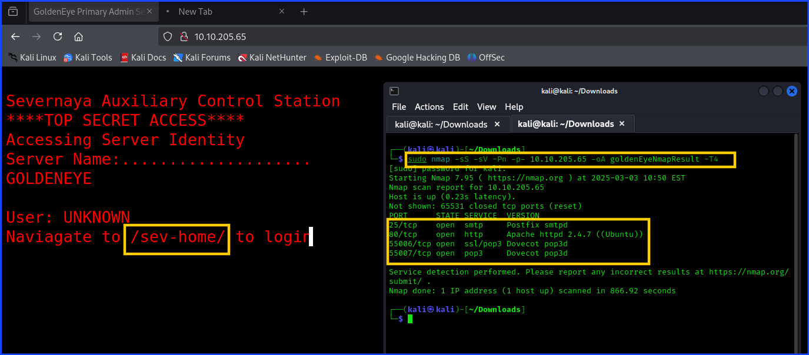
Figure 1. Nmap Scan And Found Login Page

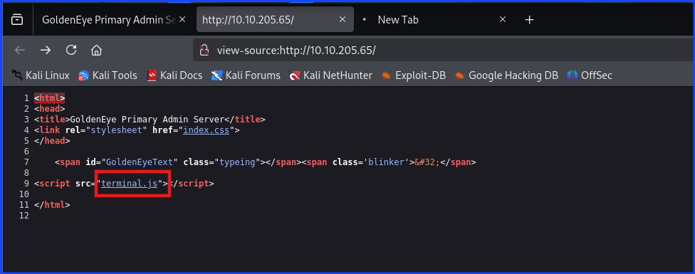
Figure 2. View Source Code

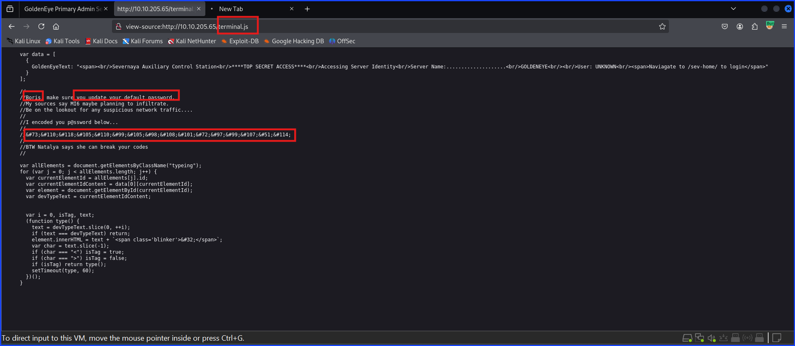
Figure 3. Boris Needs To Update His Password

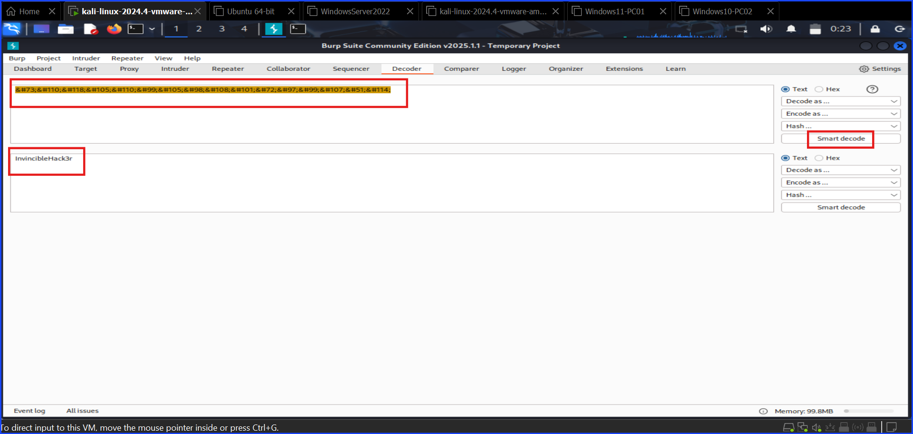
Figure 4. Crack Boris's Password With Burp Suite Decoder

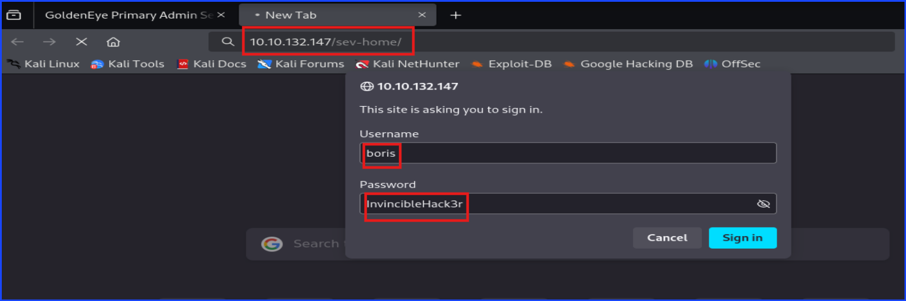
Figure 5. Login

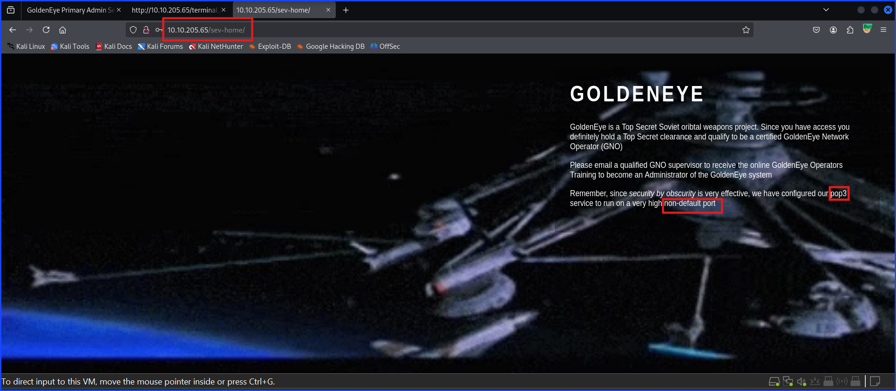
Figure 6. Login Success Found POP3

**Remediation:**

+ Remove Sensitive Information from the Landing Page

  + Do not expose the login URL or any username-related information directly on the landing page.

  + Ensure that usernames are not partially revealed, even in an obfuscated form.

+ Restrict Access to the Source Code

  + Prevent sensitive data from being included in publicly accessible JavaScript files.

  + Store credentials securely in the backend, not in client-side code.

+ Use Secure Credential Management

  + Do not hardcode or encode passwords in any publicly accessible file.

  + Use environment variables or a secure vault for storing credentials.

+ Implement Least Privilege and Secure Defaults

  + Default credentials should never be used. Ensure that all accounts require a password reset on first login.

  + Enforce strong password policies and require users to change their passwords regularly.

+ Monitor for Information Exposure

  + Regularly review public-facing code and web pages for unintentional information leakage.

  + Use automated tools to scan for sensitive data exposure.

---

**Finding 2:** Weak POP3 Authentication

**Description:**

The POP3 service was identified and accessed by capturing its banner using Netcat (nc). A password brute-force attack was performed using a common wordlist, resulting in the successful authentication of multiple user accounts, including Boris.

Upon gaining access to Boris’s email, additional usernames were enumerated, expanding the potential attack surface. Further brute-force attempts on other discovered accounts, such as Natalya and Dr. Doak, were also successful, allowing unauthorized access to their email contents. These emails contained sensitive information, including login credentials for other services.

Although Boris did not reuse his password across different systems, the exposed credentials facilitated further unauthorized access, demonstrating the risk of weak authentication mechanisms.

**Risk:**

+ **Likelihood:** High
  + The attack was successful using a common wordlist, indicating weak password policies. Attackers can easily brute-force accounts if strong authentication controls are not in place.
  
+ **Impact:** High
  + Unauthorized access to email accounts allowed for further enumeration of usernames and credentials, leading to potential compromise of other systems. Sensitive information, including login credentials for different services, was exposed.

**Tool Used:** `hydra`, Firefox, `nc`

**Evidence:**

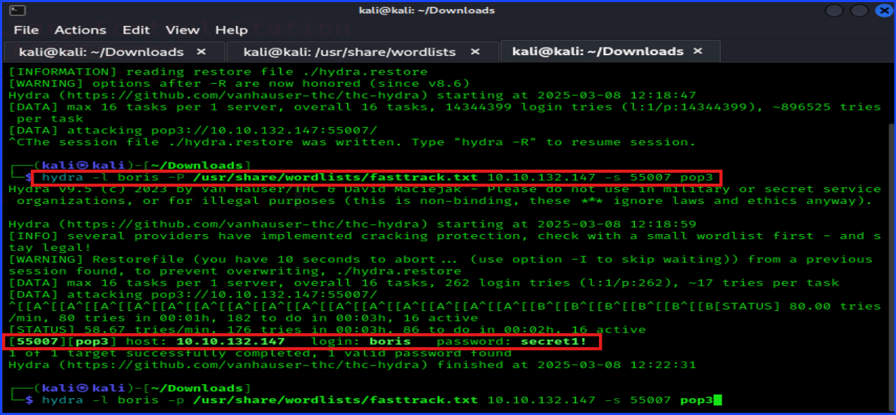
Figure 7. Boris's POP3 Password

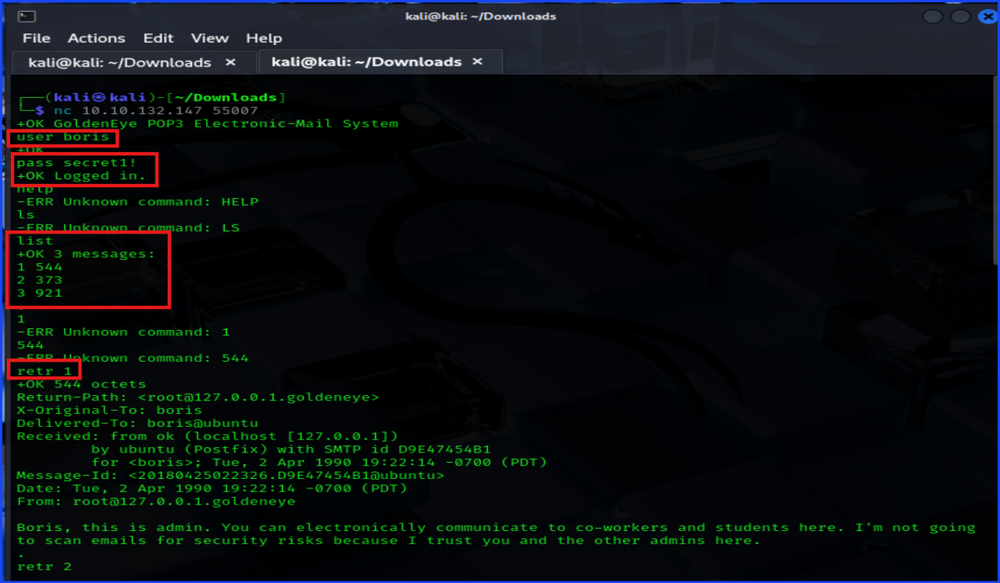
Figure 8. Login As Boris POP3

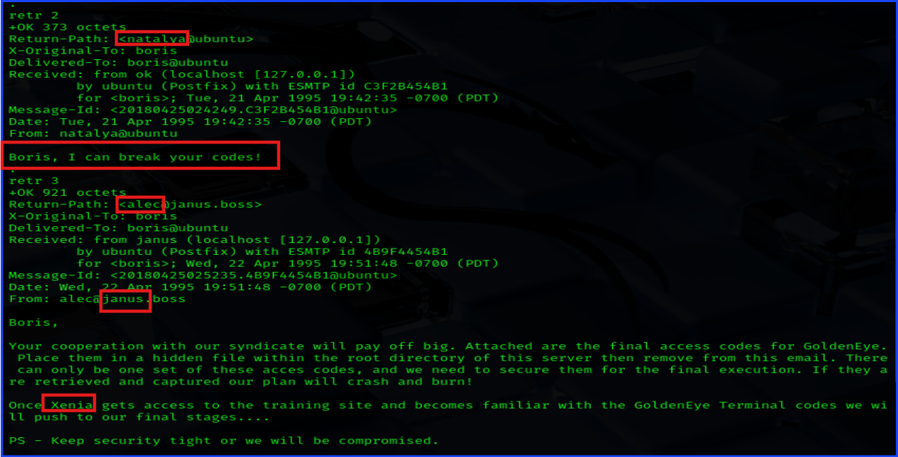
Figure 9. Boris's Email 2 And 3

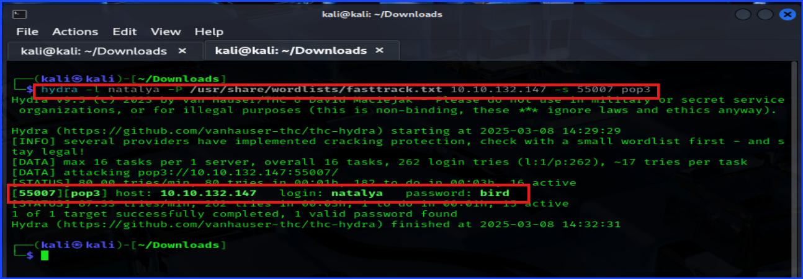
Figure 10. Natalya's POP3 Password

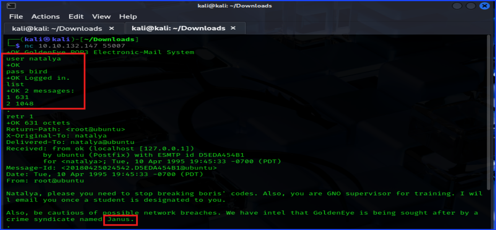
Figure 11. Natalya's POP3 Login Email

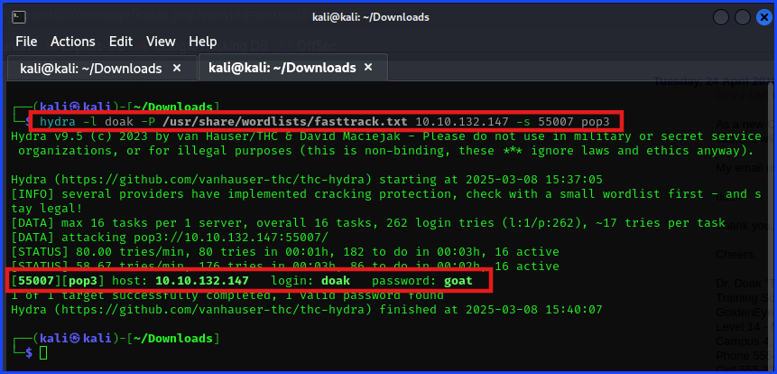
Figure 12. Doak's Password POP3

**Remediation:**

+ Enforce strong password policies, requiring complex passwords that are resistant to brute-force attacks.

+ Implement account lockout mechanisms or rate-limiting to prevent repeated failed login attempts.

+ Require multi-factor authentication (MFA) for accessing email services.

+ Monitor and log authentication attempts to detect and respond to brute-force attacks.

---

**Finding 3:** Credentials Exposed in Plaintext via Email

**Description:**

Multiple user credentials were identified in plaintext within email communications. By successfully authenticating to the POP3 service through brute-force attacks, it was possible to access emails containing login credentials.

Specifically:

+ Xenia's Moodle credentials were disclosed in an email instructing the recipient to modify their host file to access the Moodle instance.

+ Dr. Doak's Moodle credentials were found in an email, where Dr. Doak explicitly shared his login details with an external threat actor, aiding unauthorized access to the system.

The exposure of login credentials in plaintext within email communications presents a significant security risk, as attackers can leverage these credentials to gain unauthorized access to internal systems without the need for further exploitation techniques such as credential stuffing or brute-force attacks.

**Risk:**

+ **Likelihood:** Critical
  + An attacker with access to compromised email accounts can directly obtain valid credentials without additional effort.
  
+ **Impact:** Critical
  + Unauthorized access to internal systems can lead to further compromise, unauthorized data access, and privilege escalation.

**Tool Used:** `nc`, Firefox

**Evidence:**

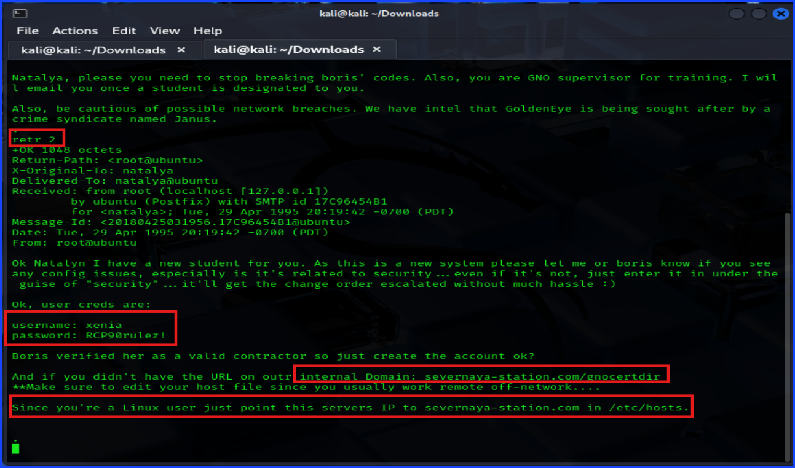
Figure 13. Natalya's POP3 Login Email 2 And Xenia's Password

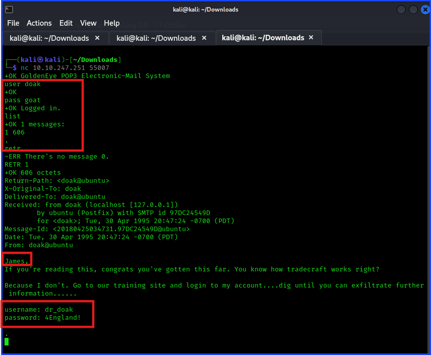
Figure 14. Login As Doak's POP3 And Found New Credential

**Remediation:**

+ Enforce a strict policy prohibiting the transmission of credentials via email.

+ Implement security controls to automatically detect and block the transmission of plaintext credentials.

+ Introduce a secure password management solution for credential sharing.

+ Require users to change passwords immediately if credentials are found to have been shared via email.

+ Implement multi-factor authentication (MFA) to mitigate unauthorized access risks.

+ Conduct security awareness training for employees regarding secure credential management practices.

---

**Finding 4:** Insider Threat: Credential Sharing

**Description:**

During the assessment, it was discovered that Dr. Doak, an internal user, was actively leaking company credentials to an external party (James). This was identified through an email exchange in which Dr. Doak explicitly provided his Moodle credentials in plaintext. This type of insider activity poses a severe security risk, as it grants unauthorized individuals access to internal systems without requiring external attack methods such as brute-force or phishing.

**Risk:**

+ **Likelihood:** High
  + An insider willingly leaking credentials means security mechanisms like password complexity or account lockout policies are ineffective.
  
+ **Impact:** Critical
  + Unauthorized access to corporate systems enables external attackers to escalate privileges, access sensitive data, and disrupt operations.

**Tool Used:** Firefox

**Evidence:**

Figure 15. Login As Doak POP3 And Found New Credential

**Remediation:**

+ Revoke all access to the company from Dr. Doak and arrest him.

+ Monitor and audit internal communications for suspicious activity, such as credential sharing in emails.

---

**Finding 5:** Data Exfiltration via Image File

**Description:**

As part of the investigation, it was discovered that Dr. Doak was involved in an insider data exfiltration operation. There was an evidence of him, under the account name `doak`, sending an email to an outsider, James, instructing him to login to his account to retrieve a secret file he hid in his account like a normal file.

That file was found during an analysis of Dr. Doak's Moodle account. Insider the secret file, there was an instruction for James, the outsider, to navigate to a specific URL to retrieve an image file `for-007.jpg` in which he claimed it contained admin credential.

**Risk:**

+ **Likelihood:** High
  + Exfiltration through easily overlooked files like images is a common tactic used by insiders or attackers to bypass security controls.
  
+ **Impact:** Critical
  + The exfiltrated data contained admin credentials, enabling an attacker to gain full control of the system, compromising sensitive data and operations.

**Tool Used:** Firefox, `nc`

**Evidence:**

Figure 16. Login As Doak POP3 And Found New Credential

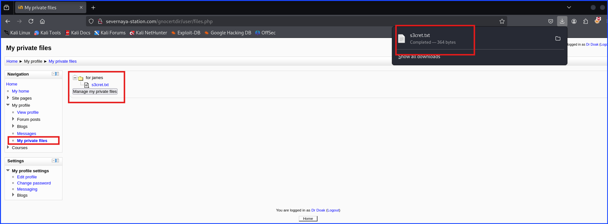
Figure 17. Dr. Doak's Secret File For James

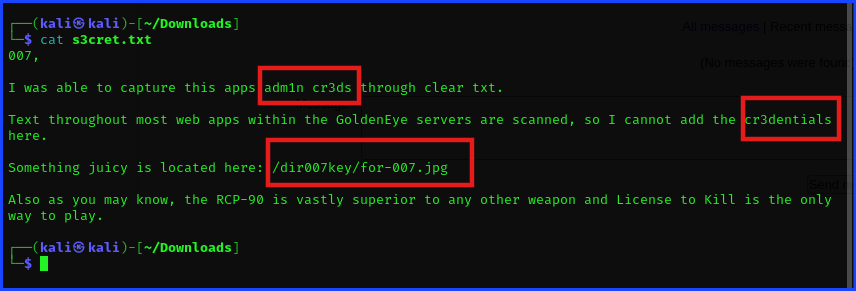
Figure 18. Secret Text To 007

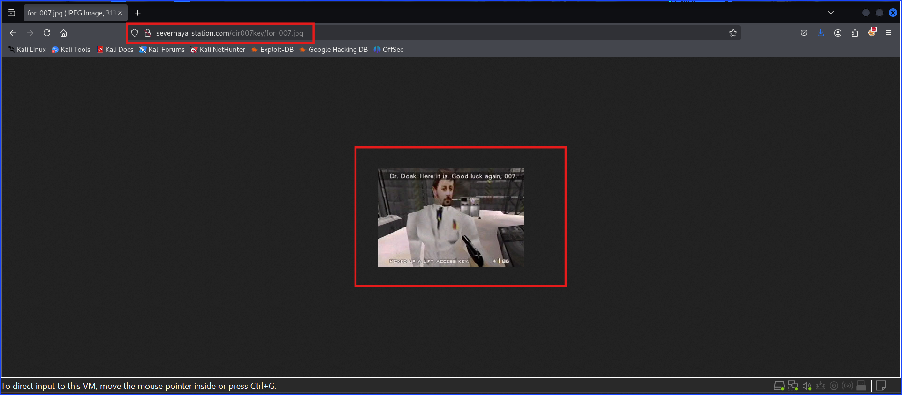
Figure 19. Directory 007 - Key For 007 Image

**Remediation:**

+ Revoke all access to the company from Dr. Doak and arrest him.

---

**Finding 6:** Extraction of Admin Credentials via Steganographic Encoding in Image File

**Description:**

During the assessment, an image file named for-007.jpg was identified as containing encoded information. Using ExifTool, metadata analysis revealed an encoded message embedded within the file. This message was decoded using Burp Suite’s decoder, revealing the Admin's password.

With these credentials, an attacker could log into the Moodle platform as an admin user, gaining access to sensitive user data, including the ability to modify settings, view all users, and further escalate privileges within the system.

**Risk:**

+ **Likelihood:** High
  + Since an attacker with access to the file could extract and decode the credentials without requiring prior privilege escalation.
  
+ **Impact:** Critical
  + Admin credentials allow full control over Moodle, including user management, configuration changes, and potential code execution.

**Tool Used:** Burp Suite Decoder, `exiftool`

**Evidence:**

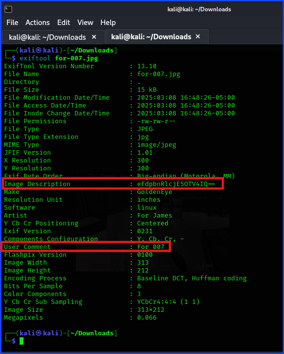
Figure 20. Use Exiftool On For007 Image

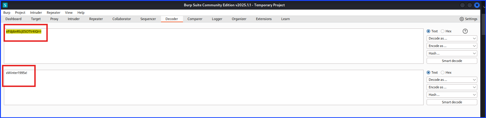
Figure 21. Use Burp Suite To Decode The Encoded Message From Doak - Base64

**Remediation:**

+ Revoke Dr. Doak's credentials immediately. Initiate an internal investigation and, if appropriate, escalate the incident through formal security and legal channels.

+ Change admin account's password to prevent further breach.

+ Check all the system to see what damages has been done to the system such as sensitive company's data and password of something highly valuable being stolen or some changes inside the system.

+ Inform high-profile clients and key stakeholders about the breach, including any potential data exposure and mitigation steps being taken.

---

**Finding 7:** Remote Code Execution via Moodle's Aspell Plugin

**Description:**

Upon logging in as the admin user, it was identified that Moodle's Aspell spell checker plugin allowed arbitrary code execution. By modifying the Aspell path setting, an attacker could inject a Python reverse shell payload.

After making the modification, the payload was triggered when attempting to spell-check content within Moodle's blog post editor. This resulted in the establishment of a reverse shell connection, allowing full system access as the web application user.

**Risk:**

+ **Likelihood:** High
  + The vulnerability exists within Moodle's configuration, and an attacker with admin credentials can easily exploit it.
  
+ **Impact:** Critical
  + Successful exploitation results in remote command execution (RCE), allowing full control of the underlying system.

**Tool Used:** `nc`, Moodle Aspell Plugin (Abused for Command Execution), Python Reverse Shell Exploit

**Evidence:**

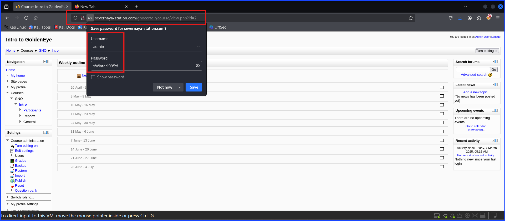
Figure 22. Login Moodle As Admin

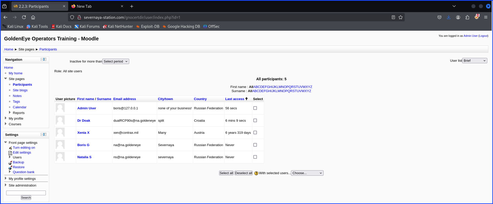
Figure 23. All Users

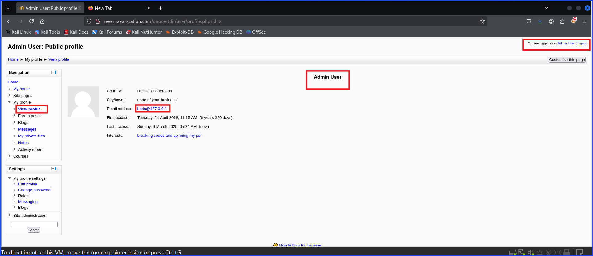
Figure 24. Boris Is Admin

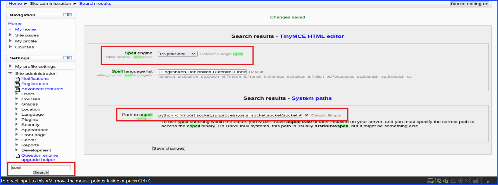
Figure 25. AddRevShellCodeToAspellAndChangeSpellEngineToPSpellShell

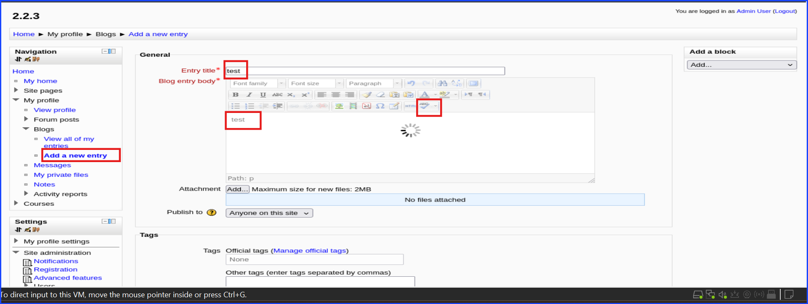
Figure 26. Spell Check

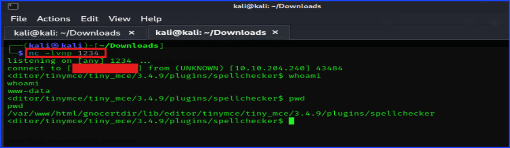
Figure 27. I Got A Shell

**Remediation:**

+ Enforce Multi-Factor Authentication (MFA) for all privileged accounts to prevent unauthorized access even if credentials are leaked.

+ Implement login alerts to notify administrators of suspicious login attempts, especially from unknown locations or devices.

+ Enable logging and monitoring for admin account activity to detect unusual access patterns, such as logins from unexpected locations or devices.

+ Disable unnecessary plugins: If Aspell isn’t needed, remove or disable it to eliminate the attack vector.

---

**Finding 8:** Unsecured File Transfers Allow Malware Delivery

**Description:**

The system permits file downloads via unencrypted HTTP, with no antivirus scanning or malware detection in place. This creates a high likelihood of malicious payload delivery and execution, exposing the environment to compromise.

**Risk:**

+ **Likelihood:** High
  + Unencrypted transfers and lack of scanning make exploitation straightforward.
  
+ **Impact:** Critical
  + Successful exploitation could enable privilege escalation, full system compromise, and long-term persistence.

  + System Compromise: Exploit files could compromise the system, leading to full control of the target machine, potentially resulting in data theft, backdoor installation, or further system exploitation.

**Tool Used:** python web server, custom exploit file

**Evidence:**

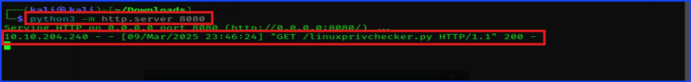
Figure 28. Set Up Python Server

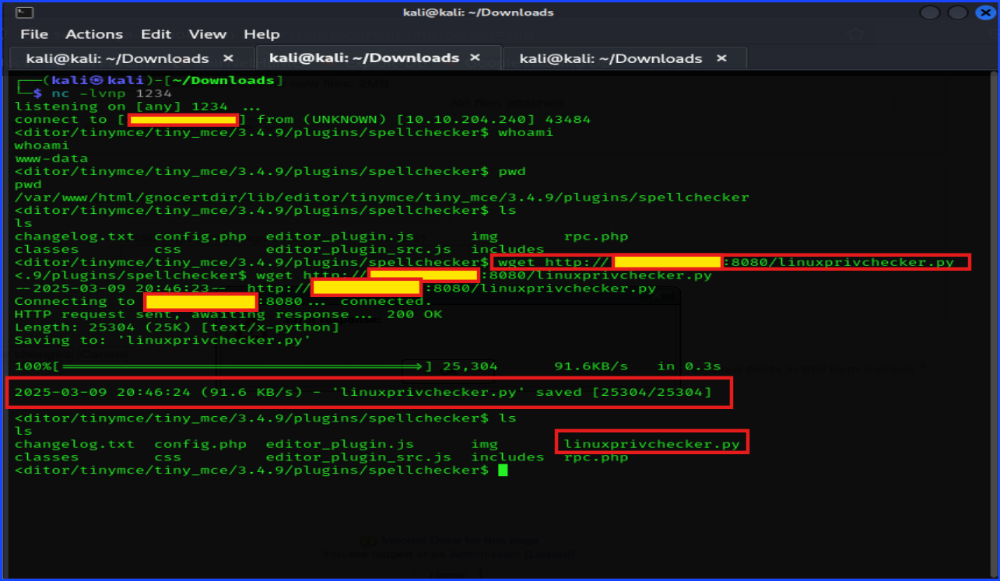
Figure 29. Wget Linux Privilege Checker Python

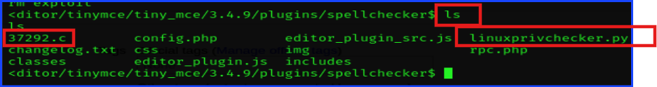
Figure 30. Download Files From My Kali Linux

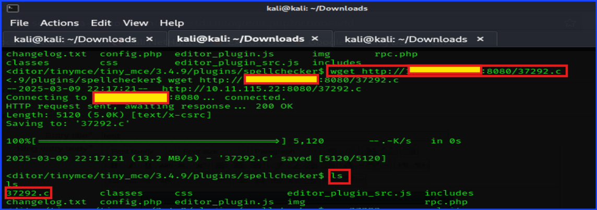
Figure 31. Download A Malicious File

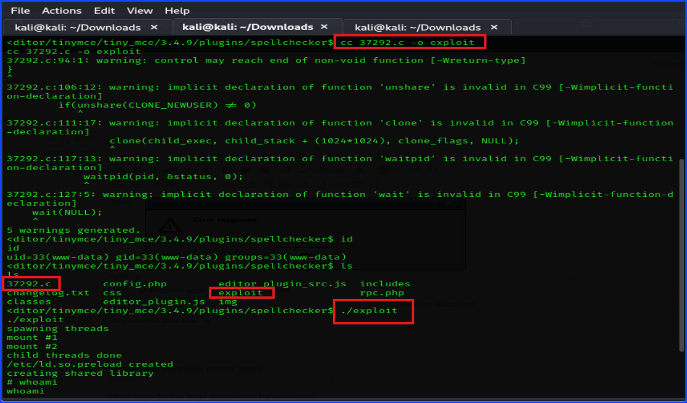
Figure 32. Successful Exploit Running Gains Root

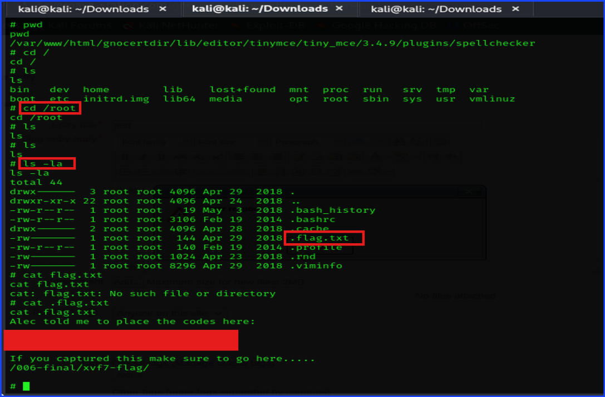
Figure 33. Get Root Flag

**Remediation:**

+ Restrict downloads to trusted sources only.

+ Enforce secure transfer protocols (HTTPS).

+ Integrate antivirus and malware scanning into file handling processes.

+ Deploy host-based intrusion prevention to detect and block malicious payloads.

## Conclusion

The penetration test identified significant issues, including credential leakage, weak authentication mechanisms, and remote code execution vulnerabilities.

By prioritizing remediation of exposed credentials, enforcing stronger authentication controls, and removing or securing high-risk plugins, Severnaya Auxiliary Control Station can substantially reduce its attack surface. Implementing these measures, alongside continuous monitoring and employee awareness training, will align the organization’s defenses with industry best practices and strengthen long-term security posture.

---

## Additional Information

Here are the credentials leaked that I got from POP3 brute-forcing.

| User | Username | Password |
| :--: | :------: | :------: |
| Boris | boris | secret1! |
| Natalie | natalya | bird |
| Doak | doak | goat |

Evidences:

Figure 34. Boris's POP3 Password

Figure 35. Natalya's POP3 Password

Figure 36. Doak's POP3 Password

Here is Boris's GoldenEye login credential.

| User | Username | Password |
| :--: | :------: | :------: |
| Boris | boris | InvincibleHack3r |

Evidence:

Figure 37. Crack Boris's Password With Burp Suit Decoder

Here is the credentials leaked in plaintext.

Figure 38. Xenia's Moodle Credential Leak In Plaintext

Figure 39. Dr.Doak's Moodle Credential Leak In Plaintext

---

**Author & Publisher:** Sangsongthong Chantaranothai

**Date Published:** March 2025
(Based on the commit where the full technical report template was completed. Subsequent edits and restructuring were made after filing this CEU/CPE claim. The original version is preserved in GitHub commit history for reference.)

**Latest Content Edit:** August 19, 2025
(Content edits only – excludes minor formatting or typo fixes.)

This report was authored and published by me as part of my professional development in cybersecurity.
In addition, it is featured as a portfolio sample within my freelancing service brand, Hexterika Cyberlab.

🌐 [LinkedIn](https://www.linkedin.com/in/sangsongthong-chantaranothai-sec/)
